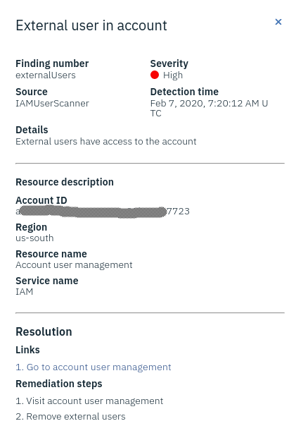

# Custom findings in IBM Cloud Security Advisor

The [IBM Cloud Security Advisor](https://cloud.ibm.com/security-advisor) allows for centralized security management. It offers a unified dashboard that alerts security administrators for an IBM Cloud account of issues and helps them in resolving the issues. The advisor supports the integration of third-party vendors as well as custom findings. Using a REST API or programming language SDKs, it is possible to manage your own security metrics - from creating incident types and events to displaying them on the unified dashboard. 

# Overview

This repository has code
* for an [interactive tool](/interactive-tool) to work with Security Advisor objects,
* [sample](/sample) objects that can be created using the tool and be used by
* [Cloud Functions actions](/functions) which scan for custom security events and create related findings in the Security Advisor.

The [setup and usage instructions](/INSTRUCTIONS.md) are provided in a separate document.

The code is also discussed in the following posts on [my blog](https://blog.4loeser.net):
* [Extend IBM Cloud Security Advisor with your own security metrics](https://blog.4loeser.net/2020/03/extend-ibm-cloud-security-advisor-with.html)
* [Manage your Security Advisor custom findings from the command line](https://blog.4loeser.net/2020/03/manage-your-security-advisor-custom.html)
* [Use Cloud Functions for security scans (IBM Cloud Security Advisor)](https://blog.4loeser.net/2020/03/use-cloud-functions-for-security-scans.html)

Similar posts have also been published on the [IBM Cloud blog](https://www.ibm.com/cloud/blog/):
* [Extend IBM Cloud Security Advisor With Your Own Security Metrics](https://www.ibm.com/cloud/blog/extend-ibm-cloud-security-advisor-with-your-own-security-metrics)
* [Manage Your Security Advisor Custom Findings from the Command Line](https://www.ibm.com/cloud/blog/manage-your-security-advisor-custom-findings-from-the-command-line)
* [Use Cloud Functions to Perform Security Scans in Security Advisor](https://www.ibm.com/cloud/blog/use-cloud-functions-to-perform-security-scans-in-security-advisor)

# License

See the [License](/LICENSE) file.
